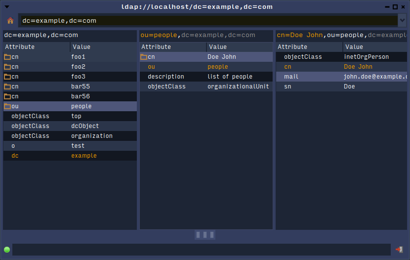
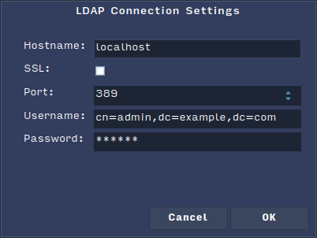
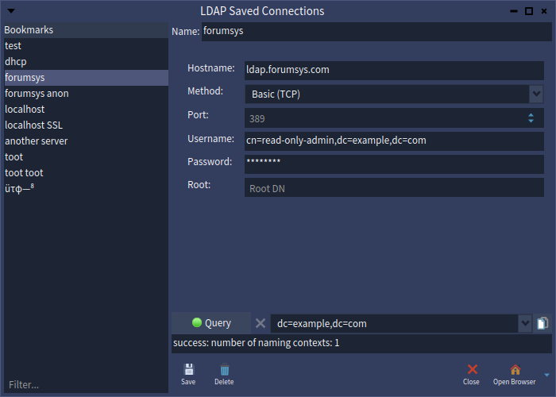
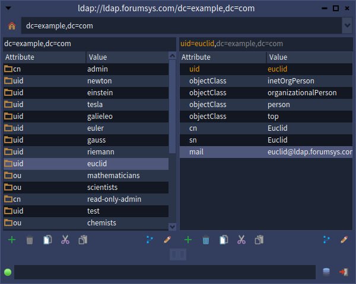
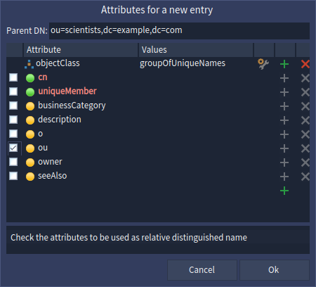
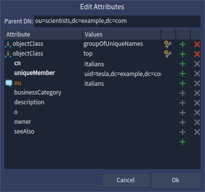

# LDAP User Interfaces

The `LDAP-Spec2` package contains several Spec presenters and applications to browse and edit LDAP data.

## Browser

The LDAP browser uses the traditional Smalltalk [Miller column widget](https://en.wikipedia.org/wiki/Miller_columns) (like the inspector) to show the entries of the LDAP server.

Selecting an sub-entry (represented with a folder icon) will show its attributes in a new column on its right.

On top, you can open the server settings dialog and select one of the roots published by the server. At the bottom, you can see the connection status and quit the current server.

## Connection

The current LDAP connection can be edited by clicking the `home` icon on the browser window.

When `OK` is clicked in this dialog, a new LDAP connection is opened and the available root distinguished names (also called naming contexts) are requested. The first one is chosen and the entries are then displayed.

## Server Bookmarks

A list of server informations can be stored in a file.

The server bookmarks window lists those servers. The entries can be reorganized  and modified there.

Additionally, you can query the naming contexts of the server displayed on the right-side.

## Editor

The editor window is very similar to the browser. The major difference is the toolbar at the bottom of each entry.

The buttons actions are:
 
   - (plus sign) add a new entry beneath the current entry
   - (trash) delete the current entry, only enabled for leaf entries
   - copy the attributes of the current entry in the editor clipboard
   - cut will store the current entry DN in the clipboard to be moved
   - paste will either create a new entry beneath the current entry or move the cut DN under the current entry

And on the right-side:

  - change the DN of the current entry, with the option to move the entry
  - edit the attributes of the current entry
 
 ### New entry dialog
 

In the empty window, you should first select the object class of the entry by clicking the configuration button of the `objectClass` attribute line.

Required attributes are shown with a green button, allowed attributes with a yellow button.

To select which attribute (or attributes) to use as the DN for the entry, check the boxes in the leftmost column.

Custom attributes can be added by clicking the `+` button on the empty last line. Note that the server might reject the new entry if any attribute description does not fit the selected object classes.

### Edit attributes dialog

The attribute editor works like the new entry dialog except you cannot edit the DN attributes.

 

